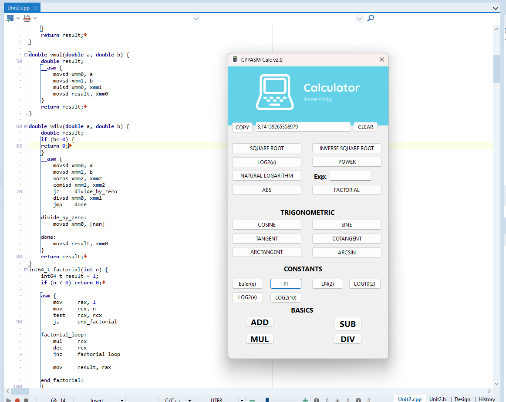

# CPPASM Calc v2.0

## Descrição

A CPPASM Calc v2.0 é uma calculadora científica avançada desenvolvida em C++ utilizando Assembly inline para operações matemáticas de alta precisão e desempenho. Esta versão inclui uma série de atualizações e melhorias para proporcionar uma experiência de cálculo mais eficiente e intuitiva.

## Funcionalidades

### Operações Matemáticas Básicas

- **Adição:** Realiza a soma de dois números.
- **Subtração:** Realiza a subtração de dois números.
- **Multiplicação:** Realiza a multiplicação de dois números.
- **Divisão:** Realiza a divisão de dois números e lida com a divisão por zero.

### Funções Matemáticas Avançadas

- **Raiz Quadrada:** Calcula a raiz quadrada de um número.
- **Seno e Cosseno:** Calcula o seno e o cosseno de um ângulo em graus.
- **Funções Trigonométricas:** Inclui tangente, cotangente e arco tangente.
- **Logaritmos e Exponenciais:** Calcula logaritmos naturais, logaritmos na base 10 e exponenciais.

### Operações Especiais

- **Fatorial:** Calcula o fatorial de um número inteiro.
- **Valor Absoluto:** Calcula o valor absoluto de um número.
- **Constantes Matemáticas:** Disponibiliza constantes como `e` (Número de Euler) e `π` (Pi).

## Novidades na Versão 2.0

### Melhorias nas Operações Básicas

A versão 2.0 traz uma atualização significativa para as operações básicas:
- **Foco Automático:** Após cada operação matemática básica (adição, subtração, multiplicação e divisão), o foco é automaticamente retornado ao campo de entrada (`Edit1`), permitindo ao usuário continuar digitando sem precisar clicar manualmente no campo.

### Atualizações Detalhadas

#### Adição (`Button22Click`)
- **Descrição:** Realiza a adição entre dois números.
- **Comportamento:** Atualiza o campo de entrada com o resultado e retorna o foco ao campo de entrada.

#### Subtração (`Button25Click`)
- **Descrição:** Realiza a subtração entre dois números.
- **Comportamento:** Atualiza o campo de entrada com o resultado e retorna o foco ao campo de entrada.

#### Multiplicação (`Button24Click`)
- **Descrição:** Realiza a multiplicação entre dois números.
- **Comportamento:** Atualiza o campo de entrada com o resultado e retorna o foco ao campo de entrada.

#### Divisão (`Button23Click`)
- **Descrição:** Realiza a divisão entre dois números e lida com a divisão por zero.
- **Comportamento:** Atualiza o campo de entrada com o resultado e retorna o foco ao campo de entrada.

### Funções Matemáticas

- **Raiz Quadrada (`Button1Click`):** Calcula a raiz quadrada do número inserido.
- **Seno (`Button2Click`):** Calcula o seno de um ângulo em graus.
- **Cosseno (`Button3Click`):** Calcula o cosseno de um ângulo em graus.
- **Tangente (`Button6Click`):** Calcula a tangente de um ângulo em graus.
- **Cotangente (`Button7Click`):** Calcula a cotangente de um ângulo em graus.
- **Arco Tangente (`Button8Click`):** Calcula o arco tangente de um valor.
- **Logaritmo Natural (`Button14Click`):** Calcula o logaritmo natural de um valor.
- **Logaritmo Base 2 (`Button12Click`):** Calcula o logaritmo na base 2 de um valor.
- **Logaritmo Base 10 (`Button13Click`):** Calcula o logaritmo na base 10 de um valor.

### Operações Especiais

- **Fatorial (`Button20Click`):** Calcula o fatorial de um número inteiro.
- **Valor Absoluto (`Button15Click`):** Calcula o valor absoluto de um número.
- **Constantes Matemáticas:**
  - **Número de Euler (`Button10Click`):** Retorna o valor de `e`.
  - **Pi (`Button11Click`):** Retorna o valor de `π`.

## Uso

1. **Digite um número** no campo de entrada (`Edit1`).
2. **Selecione a operação** desejada clicando no botão correspondente.
3. **Digite o segundo número** e clique novamente no botão da operação para obter o resultado.

### Exemplo

- Para adicionar dois números:
  1. Digite o primeiro número.
  2. Clique no botão de adição.
  3. Digite o segundo número e clique novamente no botão de adição para ver o resultado.

## Requisitos

- **C++ Builder:** Ambiente de desenvolvimento utilizado.
- **Assembly 64 bits:** Para otimização das operações matemáticas.

## Contribuição

Contribuições são bem-vindas! Se você deseja contribuir para o desenvolvimento da CPPASM Calc v2.0, por favor, faça um fork do repositório, faça suas alterações e envie um pull request.

## **Download CPPASM Calc NOW**

Win64 exe: [Download CPPASM Calc v2.0](/Project/CPPASM_Calc_v2.0.zip)

## Licença

Este projeto está licenciado sob a [MIT License](LICENSE).

