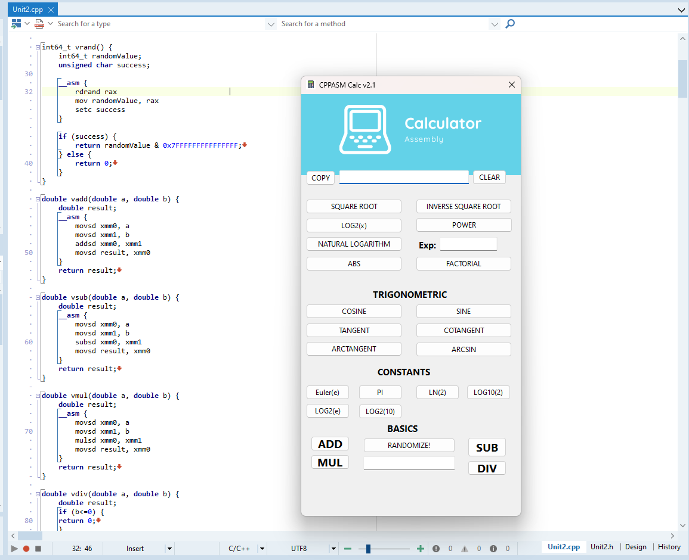

# CPPASM Calc v2.1

## Description

CPPASM Calc v2.1 is an advanced scientific calculator developed in C++ using inline Assembly for high precision and performance mathematical operations. This version includes a series of updates and improvements to provide a more efficient and intuitive calculation experience.

## Features

### Basic Mathematical Operations

- **Addition:** Performs the sum of two numbers.
- **Subtraction:** Performs the subtraction of two numbers.
- **Multiplication:** Performs the multiplication of two numbers.
- **Division:** Performs the division of two numbers and handles division by zero.

### Advanced Mathematical Functions

- **Square Root:** Calculates the square root of a number.
- **Sine and Cosine:** Calculates the sine and cosine of an angle in degrees.
- **Trigonometric Functions:** Includes tangent, cotangent, and arctangent.
- **Logarithms and Exponentials:** Calculates natural logarithms, base 10 logarithms, and exponentials.

### Special Operations

- **Factorial:** Calculates the factorial of an integer.
- **Absolute Value:** Calculates the absolute value of a number.
- **Mathematical Constants:** Provides constants such as `e` (Euler's Number) and `π` (Pi).

## New in Version 2.1

### Basic Operations Improvements

Version 2.0 brings a significant update to basic operations:
- **Automatic Focus:** After each basic mathematical operation (addition, subtraction, multiplication, and division), the focus is automatically returned to the input field (`Edit1`), allowing the user to continue typing without needing to manually click on the field.

### Detailed Updates

#### Addition (`Button22Click`)
- **Description:** Performs addition between two numbers.
- **Behavior:** Updates the input field with the result and returns the focus to the input field.

#### Subtraction (`Button25Click`)
- **Description:** Performs subtraction between two numbers.
- **Behavior:** Updates the input field with the result and returns the focus to the input field.

#### Multiplication (`Button24Click`)
- **Description:** Performs multiplication between two numbers.
- **Behavior:** Updates the input field with the result and returns the focus to the input field.

#### Division (`Button23Click`)
- **Description:** Performs division between two numbers and handles division by zero.
- **Behavior:** Updates the input field with the result and returns the focus to the input field.

### Mathematical Functions

- **Square Root (`Button1Click`):** Calculates the square root of the entered number.
- **Sine (`Button2Click`):** Calculates the sine of an angle in degrees.
- **Cosine (`Button3Click`):** Calculates the cosine of an angle in degrees.
- **Tangent (`Button6Click`):** Calculates the tangent of an angle in degrees.
- **Cotangent (`Button7Click`):** Calculates the cotangent of an angle in degrees.
- **Arctangent (`Button8Click`):** Calculates the arctangent of a value.
- **Natural Logarithm (`Button14Click`):** Calculates the natural logarithm of a value.
- **Base 2 Logarithm (`Button12Click`):** Calculates the base 2 logarithm of a value.
- **Base 10 Logarithm (`Button13Click`):** Calculates the base 10 logarithm of a value.

### Special Operations

- **Factorial (`Button20Click`):** Calculates the factorial of an integer.
- **Absolute Value (`Button15Click`):** Calculates the absolute value of a number.
- **Mathematical Constants:**
  - **Euler's Number (`Button10Click`):** Returns the value of `e`.
  - **Pi (`Button11Click`):** Returns the value of `π`.

## Usage

1. **Enter a number** in the input field (`Edit1`).
2. **Select the desired operation** by clicking the corresponding button.
3. **Enter the second number** and click the operation button again to get the result.

### Example

- To add two numbers:
  1. Enter the first number.
  2. Click the addition button.
  3. Enter the second number and click the addition button again to see the result.

## Requirements

- **C++ Builder:** Development environment used.
- **64-bit Assembly:** For optimization of mathematical operations.

## Contribution

Contributions are welcome! If you wish to contribute to the development of CPPASM Calc v2.0, please fork the repository, make your changes, and submit a pull request.

# CPPASM Calc v2.1

## Latest Release

### [CPPASM Calc v2.1 - Windows](https://github.com/victormeloasm/CPPASM-Calc/releases/tag/Random) 🚀

- **Platform:** Windows
- **Description:** This release includes the Windows version of CPPASM Calc v2.0, optimized with Assembly and full support for basic operations using SSE4.2.
- **Download:**
  - [CPPASM.Calc.v2.1.zip](https://github.com/victormeloasm/CPPASM-Calc/releases/download/Windows/CPPASM.Calc.v2.1.zip)
- **What's New:**
  - Implementation of basic mathematical operations in Assembly.
  - Bug fixes in the interface.
  - Improved performance for floating-point calculations.
  - Now supports RDRAND a hardware true random numbers generator.

## Features

* Addition, Subtraction, Multiplication, and Division with SSE4.2 support.
* Intuitive interface for easy use.
* Optimized input and output for precise floating-point calculations.

## License

This project is licensed under the [MIT License](LICENSE).

